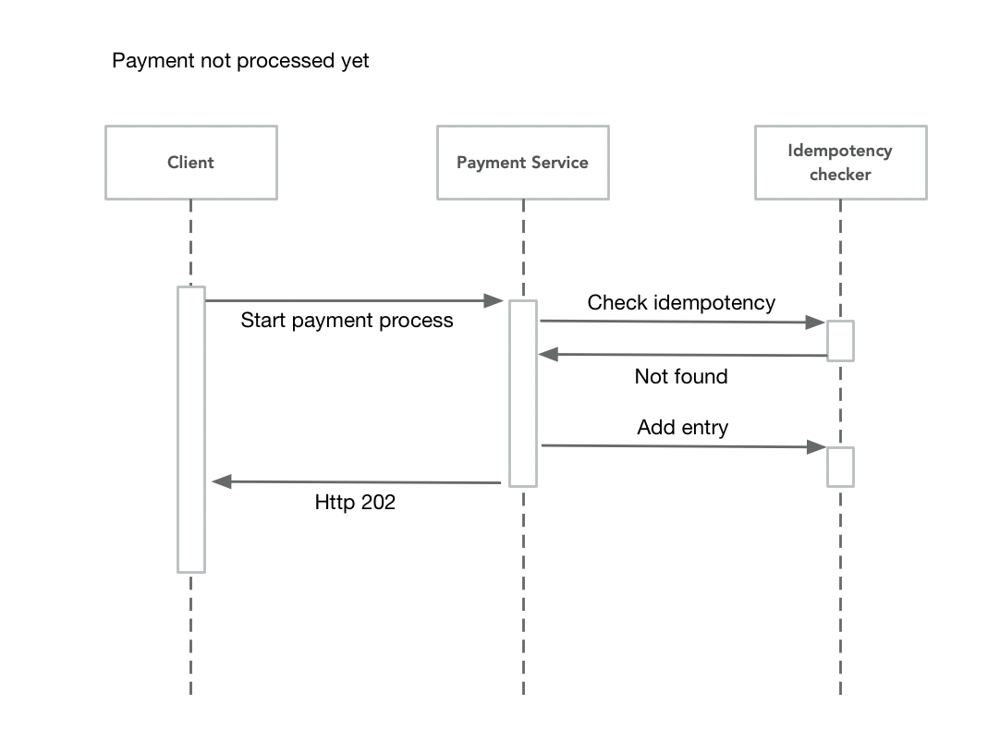
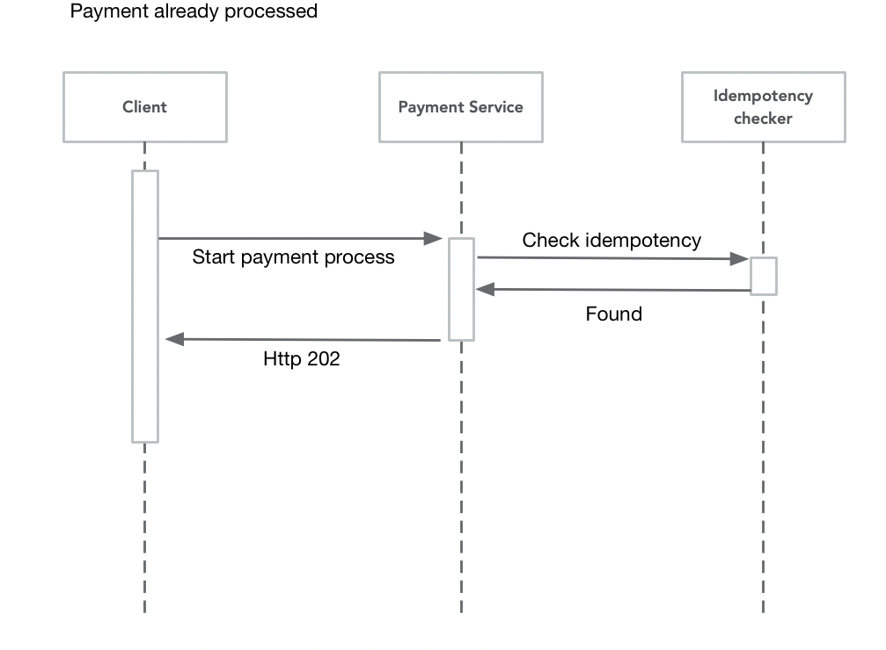
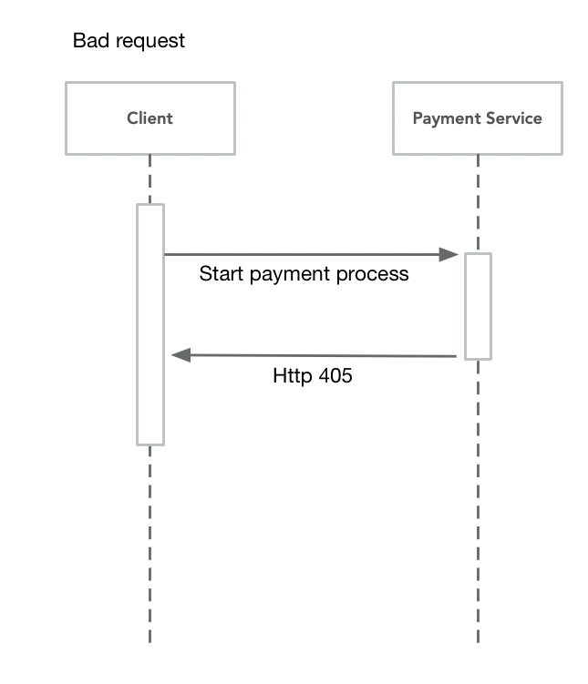

# Payment microservice

## Author
### 4AL1
* Arthur Matuszek
* Théo Gouraud
* Thomas Lemaire
* Frédéric Flacelière

## Requirements
Python 3.5.2+

## Usage
To run the server, please execute the following from the root directory:

```
pip3 install -r requirements.txt
python3 -m swagger_server
```

and open your browser to here:

```
http://localhost:8080/resource/ui/
```

Your Swagger definition lives here:

```
http://localhost:8080/resource/swagger.json
```

To launch the integration tests, use tox:
```
sudo pip install tox
tox
```

## Running with Docker

To run the server on a Docker container, please execute the following from the root directory:

```bash
# building the image
docker build -t swagger_server .

# starting up a container
docker run -p 8080:8080 swagger_server
```

---

# Diagramme de séquence

### Payment not processed yet


### Payment already processed


### bad request
